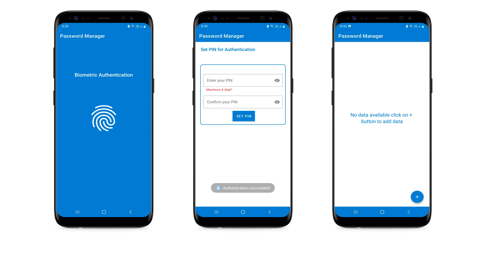
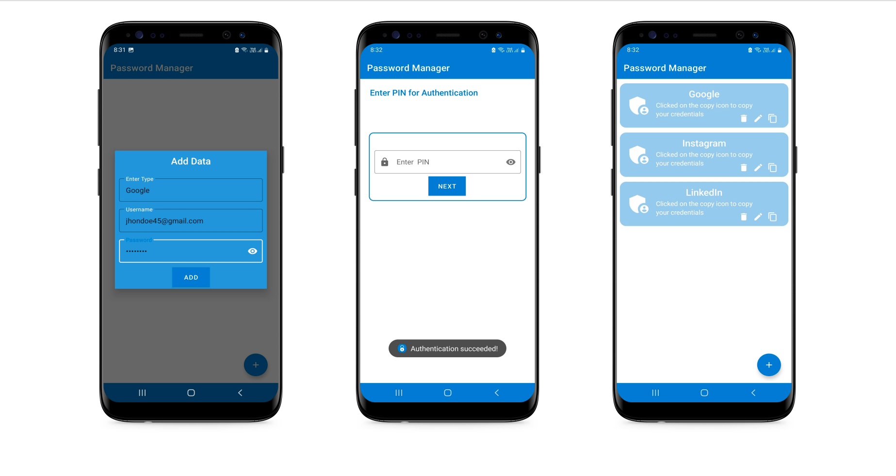

# Password Manager

The Password Manager is an Android application developed in Java that allows you to securely store and manage your passwords locally on your device. This password manager ensures the privacy and security of your passwords through AES encryption and offers biometric authentication for enhanced protection.

 
 

## Features
- Store and manage passwords securely on your device.
- AES encryption to protect password data.
- Biometric authentication for added security.

